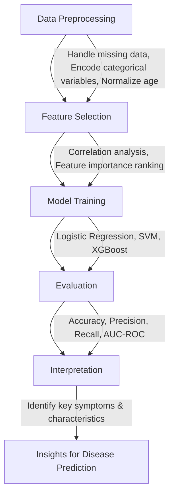

# MACHINE LEARNING AND PREDICTIVE ANALYTICS IN HEALTH CARE
### Developing Models to Predict Outcomes in Healthcare


## Table of Contents  
1. [Introduction](#introduction)  
   - [Problem Defination](#Problem-Defination)  
   - [Context and Background](#context-and-background)  
   - [Objectives and Goals](#objectives-and-goals)  
   - [Summary of Approach](#summary-of-approach)  
2. [Methods](#methods)  
   - [Data Acquisition and Sources](#data-acquisition-and-sources)  
   - [Mathematical and Statistical Models](#mathematical-and-statistical-models)  
   - [Experimental Design and Analytical Procedures](#experimental-design-and-analytical-procedures)  
   - [Software and Tools](#software-and-tools)  
   - [Ethical Considerations](#ethical-considerations) 
3. [Data Collection](#data-collection)  
4. [Model Selection](#model-selection)  
5. [Evaluation Metrics](#evaluation-metrics)  
6. [Results and Discussion](#results-and-discussion)  
7. [Conclusion](#conclusion)  
8. [References](#references) 


---

## INTRODUCTION
### PROBLEM DEFINATION

Machine learning enables healthcare prediction because healthcare institutions have better access to patient data that lets them implement earlier interventions employing individualized therapeutic approaches.
The goal of this work utilizes a patient records database to create diagnostic prediction models that will assist clinicians in both better diagnosis and healthcare decision processes.

### CONTEXT AND BACKGROUND

Healthcare predictive analysis performs pattern identification through statistical and machine learning operations on patient information. Logistic regression functions as one of the traditional methods utilized for binary classification since a long time. The predictive power of Support Vector Machines (SVM) and XGBoost increases because they can identify sophisticated patterns present in the data. The assessment of these models in actual healthcare applications becomes possible through analysis of the CSV dataset which contains demographic details and symptom information along with diagnosed diseases.

### OBJECTIVES AND GOALS
The main objectives of our capstone project focus on analytics which we detail in the three points listed below.

- Create multiple machine learning models alongside their evaluation to identify diseases.
- A comparison of the disease classification outcomes between logistic regression, SVM and XGBoost must be evaluated.
- The solution provides data assessment techniques to discover diseases early and enhance medical outcomes.
- The team conducts exploratory data analysis which includes prediction trend analysis by using visualizations.
- The system generates multiple plots containing confusion matrices together with ROC curves and feature importance charts.
- Using identified patient characteristics which affect disease predictions will help healthcare practitioners make better decisions.
- Evaluating the model's resilience requires using hyperparameter adjustment along with cross-validation.

### SUMMARY OF APPROACH

The initial stage of data analysis with exploratory data analysis (EDA) involves identifying missing data as well as studying distribution patterns and significant disease outcome influencing features. Good quality inputs into the machine learning model are achieved through preprocessing steps which involve data cleaning followed by encoding categorical values and performing feature scaling.
Patient data classification uses three predictive models including Logistic Regression as well as Support Vector Machine (SVM) and XGBoost to perform disease outcomes prediction. The training procedure starts with data splitting after which performance optimization uses hyperparameter tuning followed by applying cross-validation methods. Model assessment requires metrics based on accuracy measurements supported by precision recall and F1-score values as well as AUC-ROC curves.

This interpretation improves by using three specific visualization tools consisting of confusion matrices and feature importance plots and ROC curves. Medical diagnosis platforms for healthcare administrations prove more effective due to disease prediction indicators according to this research study.

#### LOGISTIC REGRESSION
Logistic Regression functions as a statistical method dedicated to binary classification by determining disease occurrence probabilities.

#### SUPPORT VECTOR MACHINE
 The classification technology Support Vector Machines (SVM) detects the best dividing hyperplane which separates diverse disease classes.
 
#### XGBOOST
XGBoost functions as an algorithm which uses gradient boosting to construct precise predictions from several weak prediction models.

## METHODOLOGY

### DATA AND SOURCES
The "Disease Symptoms and Patient Profile Dataset" from Kaggle served as the origin of the analyzed data. The data includes population information including age and sex data as well as patient-reported symptoms and tested disease results. The data collection process used healthcare records in combination with patient symptom assessments which underwent anonymous data processing. 
The preprocessing process includes three core procedures to replace missing data elements followed by identifying numeric representations for classification data and applying normalization techniques for numerical values for achieving better consistency and predictive success.
The "Disease Symptoms and Patient Profile Dataset" includes patient attributes that combine age with gender and symptoms as well as diagnosed diseases. The processing stage performs various operations which include null value treatment followed by group data encoding and numerical value normalization.

### MATHEMATICAL MODELS 

#### LOGISTIC REGRESSION 
The linear logistic regression model serves as a method for two-category classification. Using the sigmoid function logistic regression identifies the probability that a disease will appear.


$$
P(y=1|X) = \frac{1}{1+e^{- (\beta_0 + \beta_1 X_1 + \dots + \beta_n X_n)} }
$$

#### SUPPORT VECTOR MACHINE
The SVM technique generates a boundary hyperplane which splits data classes inside multi-dimensional spaces. The decision boundary emerges from maximizing the separation distance between data points:

$$
f(X) = w^T X + b
$$

w is the weight vector and b is the bias term.

#### XGBOOST
XGBOOST is the ensemble learning technique that builds multiple decision trees.

```math
L(\theta) = \sum_{i=1}^{n} l(y_i, \hat{y}_i) + \sum_{k} \Omega(f_k)
```
l is the loss function and omega is the regularization term.


### EXPERIMENTAL DESIGN AND ANALYTICAL PROCEDURES

The analytical steps inlcude the following;

1. DATA PREPROCESSING:
The preprocessing stage includes addressing data gaps while converting categorical groups into numerical forms (symptoms) and age normalization for numerical attributes.

2. FEATURE SELECTION:
Analysis of disease prediction features requires techniques that use correlation analysis and feature importance ranking methods.

3. MODEL TRAINING:
The baseline model of Logistic Regression received training as a benchmark for describing model performance.Support Vector Machine uses its algorithm to discover the hyperplane which provides maximum separation between different classes.
XGBoost operates through boosting methodology to combine various weak learners that improve classification outcomes.

4. EVALUATION:
The successful measurement of model accuracy requires determining the ratio of accurate predictions and precision assesses the true positive count against all detected positives. Model performance regarding its ability to detect positive cases is measured by recall and its classification capabilities are evaluated through AUC-ROC measurements.

5. INTERPRETATION:
The evaluation of models through performance metrics along with analysis of their feature importance allows practitioners to identify which patient symptoms and characteristics best indicate particular diseases.



### SOFTWARE TOOLS 

#### PROGRAMMING LANGUAGES
1. PYTHON : This is the primary language that is used in this capstone project for preprocessing the data, model training and the evaluation.
2. MACHINE LEARNING : With the help of machine learning, this project could be able to predict the outcomes and do predictive analysis with data driven decisions.

#### ENVIRONMENT 
GOOGLE COLAB : I have used google colab for the cloud-based execution of my code, I believe it has exceptional and enhanced computational resources.

#### LIBRARIES AND MODELS
1. PANDAS : Pandas are used for data manipulation and pre processing the datasets

2. NUMPY : It is used for numerical computations and data handling

3. SCIKIT-LEARN : scikit learn is used for implementing the models in the code such as SVM, Logistic and random forest.

4. XGBOOST : To perform a better feature analysis and handling.

5. MATPLOTLIB AND SEABORN : We use matplotlib and seaborn to mke visualization of the analysis for the better understanding of the data, and as well for exploratory analysis.

### ETHICAL CONSIDERATIONS
The dataset contains anonymized patient data to protect privacy. Data management needs strict ethical treatment alongside equal model prediction distribution and unbiased healthcare choices must be ensured.


## EXPREIMENTAL PROCEDURE
This project includes various steps to be considered as follows;

**INSTALL LIBRARIES**
```
import pandas as pd
import numpy as np
import matplotlib.pyplot as plt
import seaborn as sns
```

**IMPORT SCIKIT LEARN TOOLS**
```
from sklearn.model_selection import train_test_split
from sklearn.preprocessing import LabelEncoder
from sklearn.linear_model import LogisticRegression
from xgboost import XGBClassifier
from sklearn.metrics import accuracy_score, confusion_matrix, classification_report
```
**READING THE DATA**
```
file_path = "/content/Disease_symptom_and_patient_profile_dataset.csv"
df = pd.read_csv(file_path)
```
**DATA CLEANING AND TRIMMING**
```
label_encoders = {}
for col in df.columns:
    if df[col].dtype == 'object':
        le = LabelEncoder()
        df[col] = le.fit_transform(df[col])
        label_encoders[col] = le
```

**TRAIN TEST SPLIT TRAINING AND MODEL**
```
X = df.drop(columns=['Outcome Variable'])
y = df['Outcome Variable']

# Split dataset into train and test sets
X_train, X_test, y_train, y_test = train_test_split(X, y, test_size=0.2, random_state=42)

# Initialize models
models = {
    "Logistic Regression": LogisticRegression(max_iter=1000),
    "XGBoost": XGBClassifier(use_label_encoder=False, eval_metric='logloss')
}

# Train and evaluate each model
for name, model in models.items():
    print(f"\nModel: {name}")
    model.fit(X_train, y_train)
    y_pred = model.predict(X_test)
    accuracy = accuracy_score(y_test, y_pred)
    conf_matrix = confusion_matrix(y_test, y_pred)
    class_report = classification_report(y_test, y_pred)
    print(f"Accuracy: {accuracy:.2f}")
    print("Confusion Matrix:\n", conf_matrix)
    print("Classification Report:\n", class_report)
```
### LOGISTIC REGRESSION


### XGBOOST


**DATA VISUALISATION**
### CONFUSION MATRIX
```
    plt.figure(figsize=(6, 4))
    sns.heatmap(conf_matrix, annot=True, fmt='d', cmap='Blues', xticklabels=label_encoders['Outcome Variable'].classes_, yticklabels=label_encoders['Outcome Variable'].classes_)
    plt.xlabel('Predicted')
    plt.ylabel('Actual')
    plt.title(f'{name} - Confusion Matrix')
    plt.show()
```
#### LOSGISTIC REGRESSION


#### XGBOOST


```
sns.pairplot(df, hue='Outcome Variable')
plt.suptitle('Pairwise Feature Relationships', y=1.02)
plt.show()

plt.figure(figsize=(10, 8))
sns.heatmap(df.corr(), annot=True, cmap='coolwarm', fmt='.2f')
plt.title('Feature Correlation Heatmap')
plt.show()
```
#### FEATURE CO-RELATION HEATMAP

